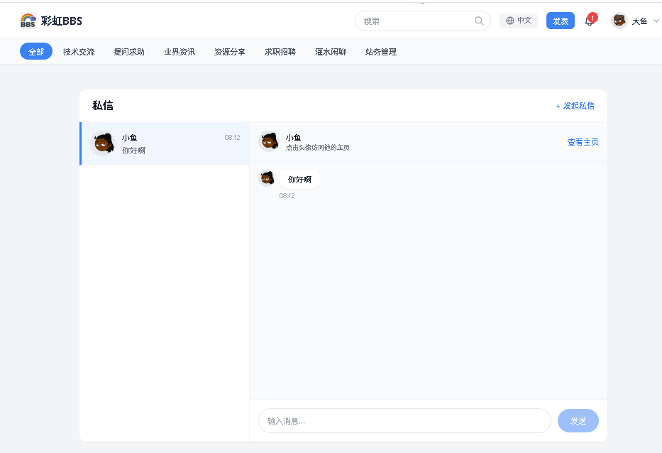
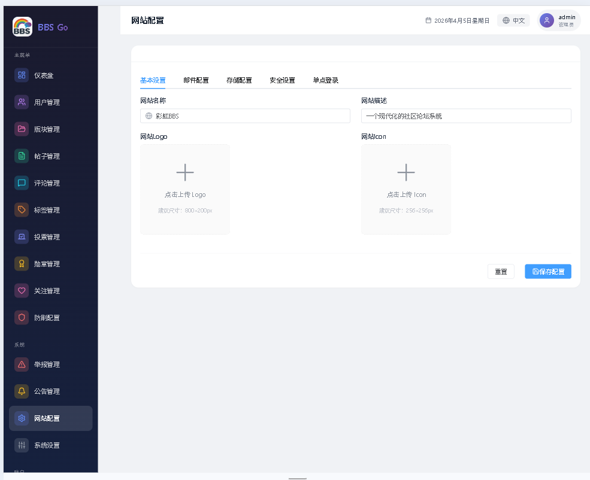

# 彩虹BBS：一个现代化的社区论坛系统

[English Version](./README-en.md)

&gt; 一款基于 Go + Vue 3 的现代化社区论坛系统，支持 Markdown 编辑、投票系统、勋章成就、防刷机制。

## 项目简介

彩虹BBS是一个功能完善的社区论坛系统，采用前后端分离架构。后端使用 Go 语言开发，前端使用 Vue 3 + Element Plus 构建。系统开箱即配，带有详细的中文注释，适合学习二次开发。

## 产品截图

### 首页


### 帖子详情


### 发表帖子


### 用户资料


### 私信系统


### 管理后台


**技术栈：**

- **后端**：Go + GORM + SQLite + gorilla/mux
- **前端**：Vue 3 + Pinia + Element Plus + Tailwind CSS
- **特性**：Markdown编辑、投票系统、勋章成就、私信通知、防刷机制

---

## 核心功能

### 1. 内容系统

#### 版块管理
系统预设8个讨论区，涵盖技术交流、提问求助、资源分享等话题：

```
全部 | 技术交流 | 提问求助 | 业界资讯 | 资源分享 | 求职招聘 | 灌水闲聊 | 站务管理
```

#### 话题发帖
- 支持 Markdown 编辑（GFM语法、代码高亮、数学公式）
- 支持图片上传（客户端压缩 + 秒传检测）
- 支持视频上传（50MB限制）
- 支持附加投票
- 支持添加话题标签（最多3个）

#### 评论系统
- 支持 @ 回复功能
- 楼主可置顶评论
- 楼主可标记「最佳评论」

---

### 2. 社交互动

#### 点赞与收藏
- 对帖子或评论点赞
- 收藏帖子到个人收藏夹

#### 关注系统
- 关注用户后可在「关注动态」中查看其最新帖子
- 被关注者获得1积分奖励

#### 私信系统
- 用户间一对一私信
- 会话列表展示
- 未读消息标记

#### 通知系统
四种通知类型，实时推送：
| 类型 | 颜色 | 触发场景 |
|------|------|----------|
| 点赞 | 红色 | 帖子/评论被点赞 |
| 评论 | 蓝色 | 帖子被评论/被回复 |
| 关注 | 绿色 | 被用户关注 |
| 勋章 | 黄色 | 获得新勋章 |

---

### 3. 投票系统

为帖子创建投票，增强用户互动：

**功能特性：**
- 单选/多选投票
- 2-10个选项
- 可设置截止时间
- 实时显示投票结果和百分比
- 每个用户每个投票只能投票一次

---

### 4. 勋章系统

9种勋章，分为三个等级：

#### 基础入门（basic）
| 勋章 | 图标 | 获得条件 |
|------|------|----------|
| 初来乍到 | newcomer | 注册即获得 |
| 首次发声 | first-post | 发布第1个帖子 |
| 热心回复 | first-comment | 发布第1条评论 |

#### 进阶成就（advanced）
| 勋章 | 图标 | 获得条件 |
|------|------|----------|
| 笔耕不辍 | writer | 发布50个帖子 |
| 社区活宝 | community-star | 发布1000条评论 |
| 广受欢迎 | popular | 累计获得1000个点赞 |
| 金牌评论 | gold-comment | 获得5次最佳评论 |

#### 顶级荣耀（top）
| 勋章 | 图标 | 获得条件 |
|------|------|----------|
| 意见领袖 | opinion-leader | 被500个用户关注 |
| 社区传奇 | legend | 注册满2年+发帖≥200+获赞≥500+最佳评论≥10 |

勋章采用自动检查机制，在用户完成特定行为后自动授予，并发送通知。

---

### 5. 积分与签到

**签到规则：**
- 每日签到1次
- 连续签到获得额外积分奖励
- 签到状态持久化

**积分规则（可配置）：**
| 操作 | 积分 |
|------|------|
| 基础签到 | +10 |
| 连续签到 | +15 |
| 被关注 | +1（被关注者获得） |

---

### 6. 防刷系统

系统内置多层防护机制：

#### 频率限制
| 配置项 | 默认值 | 说明 |
|--------|--------|------|
| topic_min_interval | 60秒 | 发帖最小间隔 |
| comment_min_interval | 30秒 | 评论最小间隔 |
| max_topics_per_day | 10 | 每日最大发帖数 |
| new_user_max_topics_per_day | 3 | 新用户每日最大发帖数 |

#### 内容质量检测
- 空内容检测
- 纯符号/表情检测
- 内容长度检测（汉字+字母+标点都计入）
- 重复字符检测（5个以上连续重复）
- 广告关键词过滤
- 外部链接数量限制

#### 举报处理
- 用户每日最多举报10次
- 举报3次后自动隐藏内容
- 7天内被隐藏5次则自动禁言3天

---

## 技术架构

### 项目结构

```
bbsgo/
├── admin/           # 管理后台 Vue 项目
│   ├── src/
│   │   ├── api/           # API 封装
│   │   ├── router/        # 路由配置
│   │   ├── stores/         # Pinia 状态管理
│   │   ├── views/          # 页面组件
│   │   └── utils/          # 工具函数
│   └── vite.config.js
│
├── site/            # 主站 Vue 项目
│   ├── src/
│   │   ├── api/           # API 封装
│   │   ├── components/    # 公共组件
│   │   ├── router/        # 路由配置
│   │   ├── stores/         # Pinia 状态管理
│   │   ├── utils/          # 工具函数
│   │   └── views/          # 页面组件
│   └── vite.config.js
│
└── server/          # Go 后端项目
    ├── handlers/            # HTTP 处理器
    ├── middleware/          # 中间件（认证、CORS）
    ├── models/              # 数据模型
    ├── services/            # 业务逻辑服务
    ├── antispam/            # 防刷系统
    ├── storage/             # 文件存储（支持本地/七牛/阿里/腾讯）
    ├── cache/               # 缓存层
    ├── database/            # 数据库连接
    ├── routes/              # 路由定义
    ├── utils/               # 工具函数
    └── main.go              # 入口文件
```

---

## 快速部署

### 环境要求
- Go 1.18+
- Node.js 16+
- SQLite 3

### 启动后端

```bash
cd server
go mod tidy
go run main.go
```

后端服务将在 `:8080` 端口启动。

### 启动前端

```bash
# 主站
cd site
npm install
npm run dev

# 管理后台
cd admin
npm install
npm run dev
```

### 初始化数据

首次启动，系统会自动创建：
- 8个默认版块
- 12个话题标签
- 1个管理员账号（admin/12345678）
- 10个测试用户
- 10条预设帖子

---

## 默认账号

- **管理员**：admin / 12345678
- **测试用户**：testuser1 ~ testuser10 / 123456

---

## 使用的开源库

### 后端 (Go)

| 库 | 版本 | 用途 |
|----|------|------|
| [GORM](https://gorm.io) | v1.25.5 | 数据库 ORM 库 |
| [modernc.org/sqlite](https://modernc.org/sqlite) | v1.48.2 | 纯 Go SQLite 驱动（无需 CGO）|
| [gorilla/mux](https://github.com/gorilla/mux) | v1.8.1 | HTTP 路由和分发器 |
| [golang-jwt/jwt](https://github.com/golang-jwt/jwt) | v5.2.0 | JWT 认证 |
| [ristretto](https://github.com/dgraph-io/ristretto) | v0.1.1 | 高性能缓存 |
| [七牛云 SDK](https://github.com/qiniu/go-sdk) | v7.18.2 | 七牛云对象存储 |
| [阿里云 OSS SDK](https://github.com/aliyun/aliyun-oss-go-sdk) | v2.1.0 | 阿里云对象存储 |
| [腾讯云 COS SDK](https://github.com/tencentyun/cos-go-sdk-v5) | v0.7.45 | 腾讯云对象存储 |
| [x/crypto](https://golang.org/x/crypto) | v0.19.0 | 加密工具库 |

### 前端 (主站 Site)

| 库 | 版本 | 用途 |
|----|------|------|
| [Vue 3](https://vuejs.org) | v3.4.0 | 渐进式 JavaScript 框架 |
| [Vue Router](https://router.vuejs.org) | v4.2.0 | Vue 官方路由 |
| [Pinia](https://pinia.vuejs.org) | v2.1.0 | 直观的状态管理 |
| [Element Plus](https://element-plus.org) | v2.13.6 | Vue 3 UI 组件库 |
| [Tailwind CSS](https://tailwindcss.com) | v3.4.0 | 实用优先的 CSS 框架 |
| [ByteMD](https://github.com/bytedance/bytemd) | v1.22.0 | Markdown 编辑器组件 |
| [Highlight.js](https://highlightjs.org) | v11.11.1 | 语法高亮 |
| [Axios](https://axios-http.com) | v1.6.0 | 基于 Promise 的 HTTP 客户端 |
| [VueUse](https://vueuse.org) | v10.7.0 | Vue 组合式工具集 |
| [markdown-it](https://github.com/markdown-it/markdown-it) | v14.1.1 | Markdown 解析器 |
| [Turndown](https://github.com/mixmark-io/turndown) | v7.2.2 | HTML 转 Markdown 转换器 |
| [html2canvas](https://html2canvas.hertzen.com) | v1.4.1 | HTML 转 Canvas 渲染器 |
| [qrcode](https://github.com/soldair/node-qrcode) | v1.5.4 | 二维码生成器 |

### 前端 (管理后台 Admin)

| 库 | 版本 | 用途 |
|----|------|------|
| [Vue 3](https://vuejs.org) | v3.4.0 | 渐进式 JavaScript 框架 |
| [Vue Router](https://router.vuejs.org) | v4.2.0 | Vue 官方路由 |
| [Pinia](https://pinia.vuejs.org) | v2.1.0 | 直观的状态管理 |
| [Element Plus](https://element-plus.org) | v2.13.6 | Vue 3 UI 组件库 |
| [Element Plus Icons](https://github.com/element-plus/element-plus-icons) | v2.3.2 | 图标库 |
| [Lucide Vue](https://lucide.dev) | v1.0.0 | 美观一致的图标 |
| [Vue I18n](https://vue-i18n.intlify.dev) | v9.14.0 | 国际化插件 |
| [Axios](https://axios-http.com) | v1.6.0 | 基于 Promise 的 HTTP 客户端 |
| [VueUse](https://vueuse.org) | v10.7.0 | Vue 组合式工具集 |
| [Vite](https://vitejs.dev) | v5.0.0 | 下一代前端构建工具 |

### 构建工具

- [Vite](https://vitejs.dev) - 下一代前端构建工具
- [Tailwind CSS](https://tailwindcss.com) - 实用优先的 CSS 框架
- [PostCSS](https://postcss.org) - 使用 JavaScript 转换 CSS 的工具
- [Autoprefixer](https://github.com/postcss/autoprefixer) - 解析 CSS 并添加浏览器前缀

---

## 总结

彩虹BBS是一个功能完善的社区论坛系统，代码结构清晰，注释详细，适合：

1. **学习参考**：前后端分离架构，Vue 3 + Go 实战
2. **二次开发**：模块化设计，易于扩展
3. **快速上线**：开箱即用，配有详细文档

如果你正在寻找一个社区论坛的参考项目，或者需要二次开发一个类似的产品，彩虹BBS将是一个不错的选择。

---

*欢迎 Star 和 Fork，有问题可以提 Issue。*

