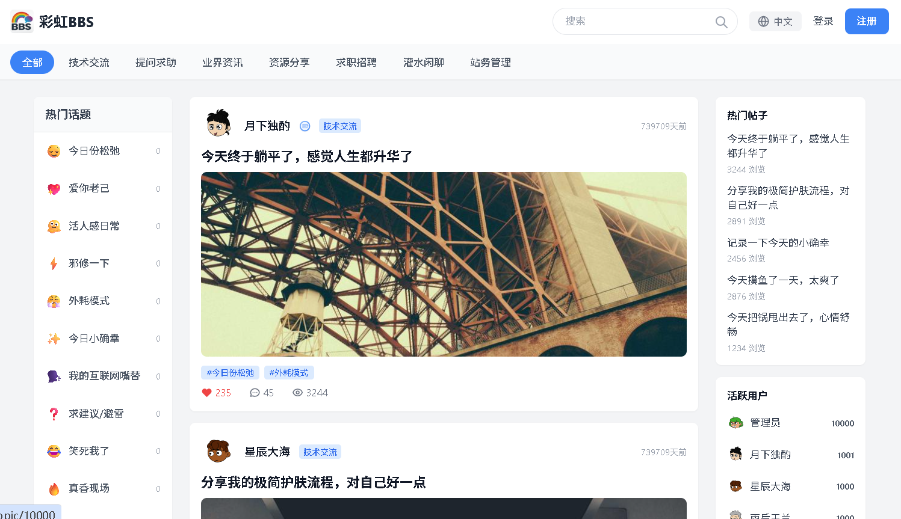
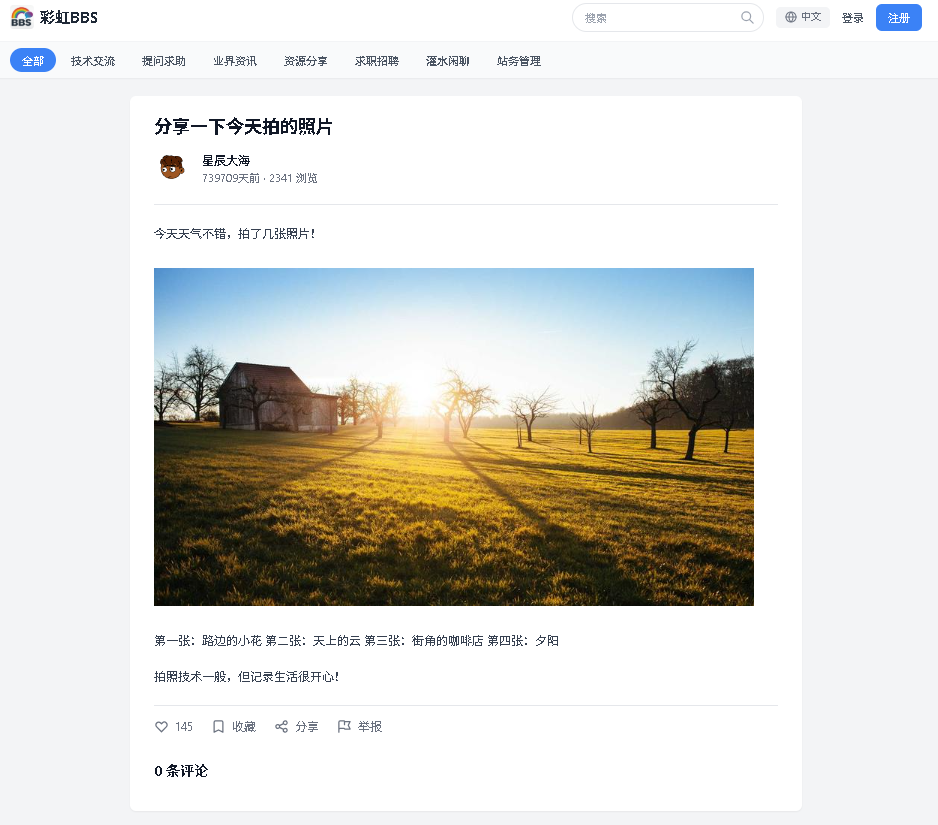
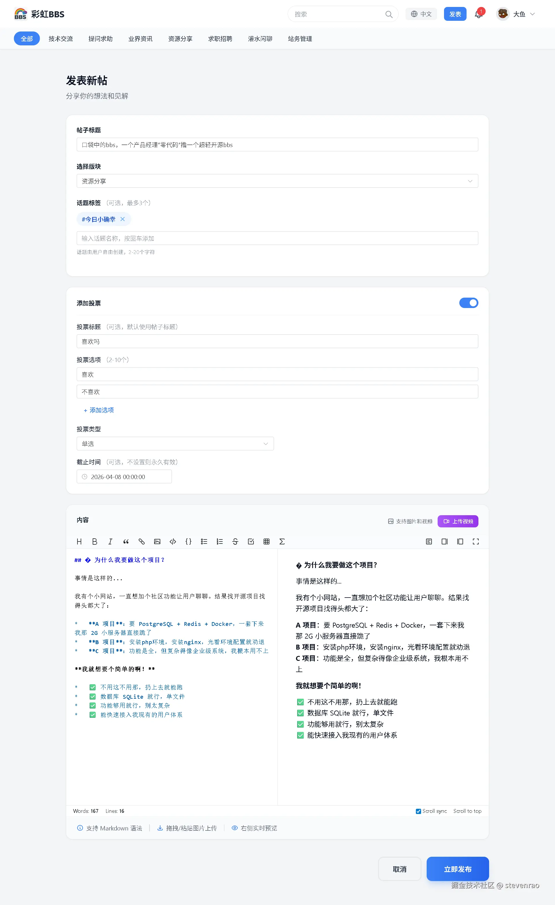
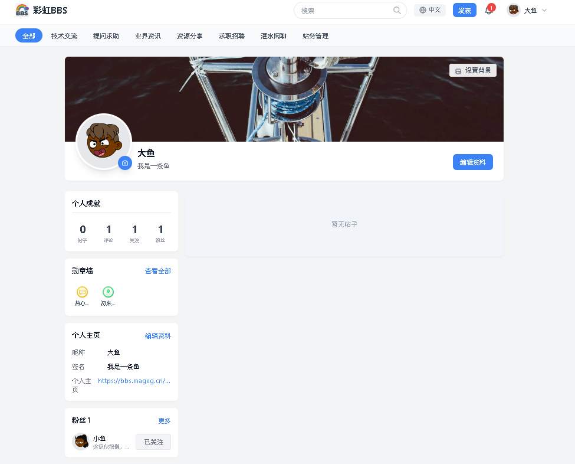
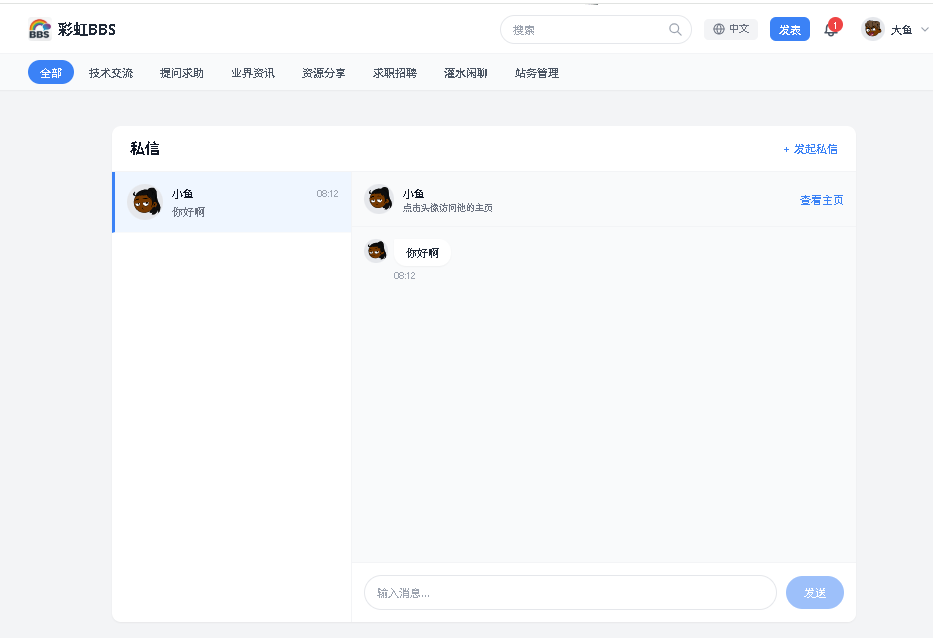
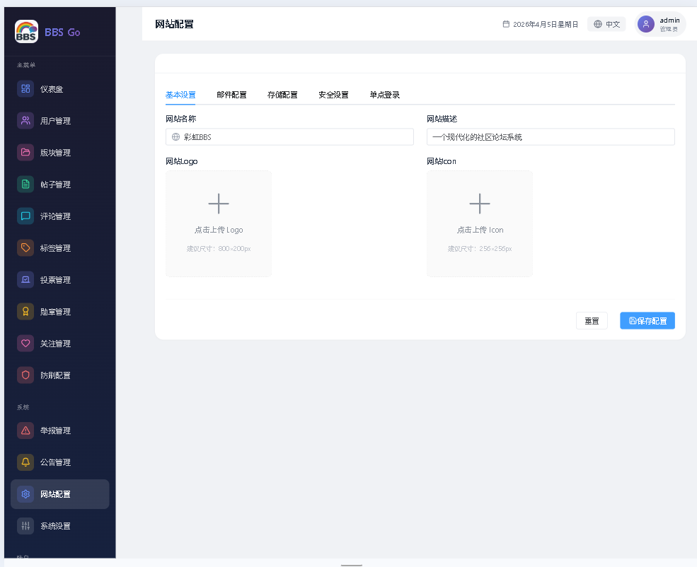

# Rainbow BBS: A Modern Community Forum System

[中文版本](./README-CN.md)

> A modern community forum system based on Go + Vue 3, featuring Markdown editing, polling system, badge achievements, and anti-spam mechanisms.

## Project Overview

Rainbow BBS is a full-featured community forum system with a frontend-backend separated architecture. The backend is developed in Go, and the frontend is built with Vue 3 + Element Plus. The system comes out of the box with detailed Chinese comments, suitable for learning and secondary development.

## Screenshots

### Home Page


### Topic List


### Post Detail


### User Profile


### Chat System


### Admin Console


**Tech Stack:**

- **Backend**: Go + GORM + SQLite + gorilla/mux
- **Frontend**: Vue 3 + Pinia + Element Plus + Tailwind CSS
- **Features**: Markdown editing, polling system, badge achievements, private messaging, anti-spam mechanisms

---

## Core Features

### 1. Content System

#### Forum Management
The system comes with 8 predefined discussion sections covering various topics:

```
All | Technology Exchange | Q&amp;A | Industry News | Resource Sharing | Job Hunting | Chit-Chat | Site Management
```

#### Topic Posting
- Supports Markdown editing (GFM syntax, code highlighting, mathematical formulas)
- Supports image upload (client-side compression + instant upload detection)
- Supports video upload (50MB limit)
- Supports adding polls
- Supports adding topic tags (up to 3 tags)

#### Comment System
- Supports @mention replies
- OP can pin comments
- OP can mark "Best Comment"

---

### 2. Social Interaction

#### Likes and Favorites
- Like posts or comments
- Save posts to personal favorites

#### Follow System
- After following a user, you can view their latest posts in "Follow Feed"
- Followee receives 1 reputation point reward

#### Private Messaging
- One-on-one private messages between users
- Conversation list display
- Unread message indicator

#### Notification System
Four notification types, real-time push:
| Type | Color | Trigger Scenario |
|------|-------|------------------|
| Like | Red | Post/comment liked |
| Comment | Blue | Post commented/reply |
| Follow | Green | Being followed |
| Badge | Yellow | New badge earned |

---

### 3. Polling System

Create polls for posts to enhance user interaction:

**Features:**
- Single/multiple choice voting
- 2-10 options
- Configurable deadline
- Real-time display of voting results and percentages
- Each user can vote only once per poll

---

### 4. Badge System

9 badges divided into three tiers:

#### Basic (basic)
| Badge | Icon | Condition |
|-------|------|-----------|
| Newcomer | newcomer | Register and receive |
| First Voice | first-post | Publish 1st post |
| Enthusiastic Replier | first-comment | Publish 1st comment |

#### Advanced (advanced)
| Badge | Icon | Condition |
|-------|------|-----------|
| Hardworking Writer | writer | Publish 50 posts |
| Community Star | community-star | Publish 1000 comments |
| Widely Popular | popular | 1000 total likes received |
| Gold Comment | gold-comment | 5 best comments |

#### Top (top)
| Badge | Icon | Condition |
|-------|------|-----------|
| Opinion Leader | opinion-leader | Followed by 500 users |
| Community Legend | legend | Registered 2+ years + 200+ posts + 500+ likes + 10+ best comments |

Badges use an automatic check mechanism, awarded automatically after users complete specific actions, with notifications sent.

---

### 5. Reputation and Check-in

**Check-in Rules:**
- Daily check-in
- Consecutive check-in earns extra reputation rewards
- Check-in status persisted

**Reputation Rules (configurable):**
| Action | Reputation |
|--------|------------|
| Basic check-in | +10 |
| Consecutive check-in | +15 |
| Being followed | +1 (reward for followee) |

---

### 6. Anti-spam System

Built-in multi-layer protection mechanisms:

#### Rate Limiting
| Config | Default | Description |
|--------|---------|-------------|
| topic_min_interval | 60s | Minimum post interval |
| comment_min_interval | 30s | Minimum comment interval |
| max_topics_per_day | 10 | Maximum posts per day |
| new_user_max_topics_per_day | 3 | Maximum posts per day for new users |

#### Content Quality Check
- Empty content detection
- Pure symbol/emoji detection
- Content length check (includes Chinese characters + letters + punctuation)
- Repeated character detection (5+ consecutive repeats)
- Advertising keyword filtering
- External link count limit

#### Report Handling
- Users can report up to 10 times per day
- Content automatically hidden after 3 reports
- Automatic 3-day ban after 5 hides within 7 days

---

## Technical Architecture

### Project Structure

```
bbsgo/
├── admin/           # Admin panel Vue project
│   ├── src/
│   │   ├── api/           # API encapsulation
│   │   ├── router/        # Router config
│   │   ├── stores/         # Pinia state management
│   │   ├── views/          # Page components
│   │   └── utils/          # Utility functions
│   └── vite.config.js
│
├── site/            # Main site Vue project
│   ├── src/
│   │   ├── api/           # API encapsulation
│   │   ├── components/    # Common components
│   │   ├── router/        # Router config
│   │   ├── stores/         # Pinia state management
│   │   ├── utils/          # Utility functions
│   │   └── views/          # Page components
│   └── vite.config.js
│
└── server/          # Go backend project
    ├── handlers/            # HTTP handlers
    ├── middleware/          # Middleware (auth, CORS)
    ├── models/              # Data models
    ├── services/            # Business logic services
    ├── antispam/            # Anti-spam system
    ├── storage/             # File storage (local/Qiniu/Aliyun/Tencent)
    ├── cache/               # Cache layer
    ├── database/            # Database connection
    ├── routes/              # Route definitions
    ├── utils/               # Utility functions
    └── main.go              # Entry file
```

---

## Quick Deployment

### Environment Requirements
- Go 1.18+
- Node.js 16+
- SQLite 3

### Start Backend

```bash
cd server
go mod tidy
go run main.go
```

Backend service will start on `:8080`.

### Start Frontend

```bash
# Main site
cd site
npm install
npm run dev

# Admin panel
cd admin
npm install
npm run dev
```

### Initialize Data

On first launch, the system will automatically create:
- 8 default forums
- 12 topic tags
- 1 admin account (admin/12345678)
- 10 test users
- 10 preset posts

---

## Default Accounts

- **Admin**: admin / 12345678
- **Test Users**: testuser1 ~ testuser10 / 123456

---

## Open Source Libraries Used

### Backend (Go)

| Library | Version | Purpose |
|---------|---------|---------|
| [GORM](https://gorm.io) | v1.25.5 | ORM library for database operations |
| [SQLite Driver](https://github.com/mattn/go-sqlite3) | v1.14.17 | SQLite database driver |
| [gorilla/mux](https://github.com/gorilla/mux) | v1.8.1 | HTTP router and dispatcher |
| [golang-jwt/jwt](https://github.com/golang-jwt/jwt) | v5.2.0 | JWT authentication |
| [ristretto](https://github.com/dgraph-io/ristretto) | v0.1.1 | High performance cache |
| [Qiniu SDK](https://github.com/qiniu/go-sdk) | v7.18.2 | Qiniu Cloud Storage |
| [Aliyun OSS SDK](https://github.com/aliyun/aliyun-oss-go-sdk) | v2.1.0 | Alibaba Cloud OSS |
| [Tencent COS SDK](https://github.com/tencentyun/cos-go-sdk-v5) | v0.7.45 | Tencent Cloud COS |
| [x/crypto](https://golang.org/x/crypto) | v0.19.0 | Cryptography utilities |

### Frontend (Site)

| Library | Version | Purpose |
|---------|---------|---------|
| [Vue 3](https://vuejs.org) | v3.4.0 | Progressive JavaScript framework |
| [Vue Router](https://router.vuejs.org) | v4.2.0 | Official router for Vue |
| [Pinia](https://pinia.vuejs.org) | v2.1.0 | Intuitive state management |
| [Element Plus](https://element-plus.org) | v2.13.6 | Vue 3 UI component library |
| [Tailwind CSS](https://tailwindcss.com) | v3.4.0 | Utility-first CSS framework |
| [ByteMD](https://github.com/bytedance/bytemd) | v1.22.0 | Markdown editor component |
| [Highlight.js](https://highlightjs.org) | v11.11.1 | Syntax highlighting |
| [Axios](https://axios-http.com) | v1.6.0 | Promise based HTTP client |
| [VueUse](https://vueuse.org) | v10.7.0 | Collection of Vue composition utilities |
| [markdown-it](https://github.com/markdown-it/markdown-it) | v14.1.1 | Markdown parser |
| [Turndown](https://github.com/mixmark-io/turndown) | v7.2.2 | HTML to Markdown converter |
| [html2canvas](https://html2canvas.hertzen.com) | v1.4.1 | HTML to canvas renderer |
| [qrcode](https://github.com/soldair/node-qrcode) | v1.5.4 | QR code generator |

### Frontend (Admin)

| Library | Version | Purpose |
|---------|---------|---------|
| [Vue 3](https://vuejs.org) | v3.4.0 | Progressive JavaScript framework |
| [Vue Router](https://router.vuejs.org) | v4.2.0 | Official router for Vue |
| [Pinia](https://pinia.vuejs.org) | v2.1.0 | Intuitive state management |
| [Element Plus](https://element-plus.org) | v2.13.6 | Vue 3 UI component library |
| [Element Plus Icons](https://github.com/element-plus/element-plus-icons) | v2.3.2 | Icon library |
| [Lucide Vue](https://lucide.dev) | v1.0.0 | Beautiful & consistent icons |
| [Vue I18n](https://vue-i18n.intlify.dev) | v9.14.0 | Internationalization plugin |
| [Axios](https://axios-http.com) | v1.6.0 | Promise based HTTP client |
| [VueUse](https://vueuse.org) | v10.7.0 | Collection of Vue composition utilities |
| [Vite](https://vitejs.dev) | v5.0.0 | Next generation frontend tooling |

### Build Tools

- [Vite](https://vitejs.dev) - Next generation frontend tooling
- [Tailwind CSS](https://tailwindcss.com) - Utility-first CSS framework
- [PostCSS](https://postcss.org) - A tool for transforming CSS with JavaScript
- [Autoprefixer](https://github.com/postcss/autoprefixer) - Parse CSS and add vendor prefixes

---

## Summary

Rainbow BBS is a full-featured community forum system with clear code structure and detailed comments, suitable for:

1. **Learning Reference**: Frontend-backend separated architecture, Vue 3 + Go in action
2. **Secondary Development**: Modular design, easy to extend
3. **Quick Launch**: Out of the box, with detailed documentation

If you're looking for a reference project for a community forum or need to develop a similar product, Rainbow BBS is a good choice.

---

*Welcome to Star and Fork, feel free to raise Issues.*

